# How kb works

This document follows the data through the engine, from a line in
`sources.yaml` to a cited answer in an agent session and a bundle on another
device. The [README](../README.md) lists the commands and their options; this
page explains what happens inside them. File and function names refer to
`src/kb/`.

## 1. The big picture

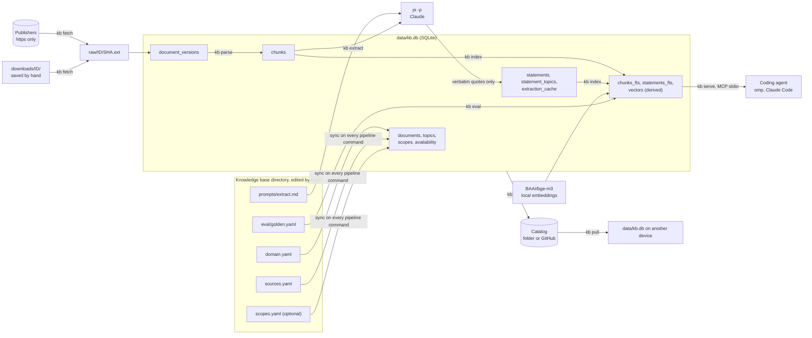
```mermaid
flowchart LR
    subgraph cfg["Knowledge base directory, edited by hand"]
        D["domain.yaml"]
        S["sources.yaml"]
        SC["scopes.yaml (optional)"]
        P["prompts/extract.md"]
        G["eval/golden.yaml"]
    end
    WEB[("Publishers<br/>https only")]
    DL["downloads/ID/<br/>saved by hand"]
    RAW["raw/ID/SHA.ext"]
    PI["pi -p<br/>Claude"]
    EMB["BAAI/bge-m3<br/>local embeddings"]
    subgraph db["data/kb.db (SQLite)"]
        T1["documents, topics,<br/>scopes, availability"]
        T2["document_versions"]
        T3["chunks"]
        T4["statements, statement_topics,<br/>extraction_cache"]
        T5["chunks_fts, statements_fts,<br/>vectors (derived)"]
    end
    AG["Coding agent<br/>omp, Claude Code"]
    CAT[("Catalog<br/>folder or GitHub")]
    D & S & SC -->|"sync on every pipeline command"| T1
    WEB -->|"kb fetch"| RAW
    DL -->|"kb fetch"| RAW
    RAW --> T2
    T2 -->|"kb parse"| T3
    T3 -->|"kb extract"| PI
    P --> PI
    PI -->|"verbatim quotes only"| T4
    T3 & T4 -->|"kb index"| T5
    EMB --> T5
    T5 -->|"kb serve, MCP stdio"| AG
    G -->|"kb eval"| T5
    db -->|"kb publish"| CAT
    CAT -->|"kb pull"| OTHER["data/kb.db on another device"]
```

Three ideas carry the design:

- **Every claim is quoted.** A statement is stored only when its quote appears
  in its section, so an agent can cite `source_id` and `section_ref` and a
  reader can check the words.
- **Plain tables are the truth; indexes are derived.** `kb index` rebuilds the
  full-text tables and the vectors from the plain tables at any time, and
  `kb publish` leaves them out.
- **Every step is incremental.** Downloads are keyed by content hash, chunks by
  version, model output by the exact prompt, vectors by the hash of their text.
  A re-run only pays for what changed.

## 2. Where state lives

| Location | Content | Written by |
|---|---|---|
| `DIR/domain.yaml`, `sources.yaml`, `scopes.yaml`, `prompts/`, `eval/` | configuration | you (`setup` creates templates) |
| `DIR/data/kb.db` | the knowledge base | every pipeline command |
| `DIR/raw/<source>/<sha256>.<ext>` | downloads, one file per distinct content | `kb fetch` |
| `DIR/downloads/<source>/`, `downloads/ingest.sh` | files saved by hand, the ingest script | you, `kb fetch` |
| checkout of this repository | the engine, run with `uv run --project` | git |
| `~/.cache/huggingface` | the embedding model, shared read-only | `kb index` |
| `~/.config/kb/identity.txt` (`$KB_AGE_IDENTITY`) | your age identity | `kb keygen` |
| `~/.config/kb/catalog` | the saved catalog location | the menu's connect |
| `~/.omp/agent/mcp.json` | MCP server registrations | `setup`, `pull`, the menu |
| catalog directory | `NAME/manifest.json`, `recipients.txt`, bundles or release references | `kb publish` |

`kb -C DIR` changes into `DIR` before any command runs, so every relative
default (`data/kb.db`, `raw`, `prompts/extract.md`, `scopes.yaml`) resolves
against the knowledge base directory. Directories share no state; several
knowledge bases build and serve side by side.

## 3. Module map

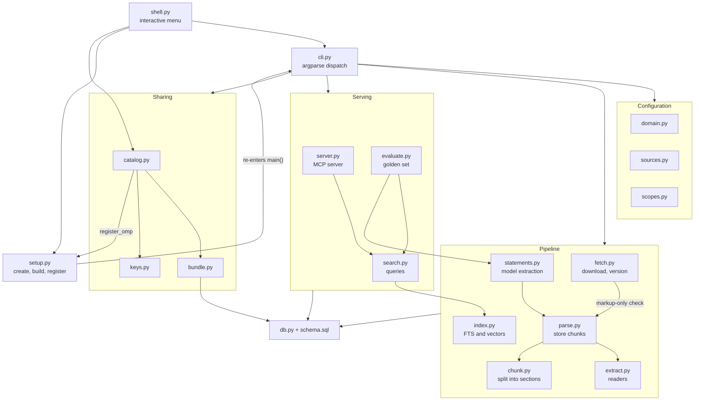
```mermaid
flowchart TD
    cli["cli.py<br/>argparse dispatch"]
    shell["shell.py<br/>interactive menu"]
    setupm["setup.py<br/>create, build, register"]
    subgraph config["Configuration"]
        domain["domain.py"]
        sources["sources.py"]
        scopes["scopes.py"]
    end
    subgraph pipeline["Pipeline"]
        fetch["fetch.py<br/>download, version"]
        parse["parse.py<br/>store chunks"]
        extract["extract.py<br/>readers"]
        chunk["chunk.py<br/>split into sections"]
        statements["statements.py<br/>model extraction"]
        index["index.py<br/>FTS and vectors"]
    end
    subgraph serving["Serving"]
        server["server.py<br/>MCP server"]
        search["search.py<br/>queries"]
        evaluate["evaluate.py<br/>golden set"]
    end
    subgraph sharing["Sharing"]
        catalog["catalog.py"]
        bundle["bundle.py"]
        keys["keys.py"]
    end
    dbm["db.py + schema.sql"]
    shell --> cli
    shell --> setupm
    shell --> catalog
    setupm -->|"re-enters main()"| cli
    cli --> config
    cli --> pipeline
    cli --> serving
    cli --> sharing
    fetch -->|"markup-only check"| parse
    parse --> extract
    parse --> chunk
    statements --> parse
    search --> index
    server --> search
    evaluate --> search
    evaluate --> statements
    catalog --> bundle
    catalog --> keys
    catalog -->|"register_omp"| setupm
    pipeline --> dbm
    serving --> dbm
    bundle --> dbm
```

`cli.main` is the single entry point. `setup.build` and the menu do not
duplicate pipeline logic: they call `cli.main` again with an argument list,
so a menu entry and the matching command run the same code.

## 4. Data model

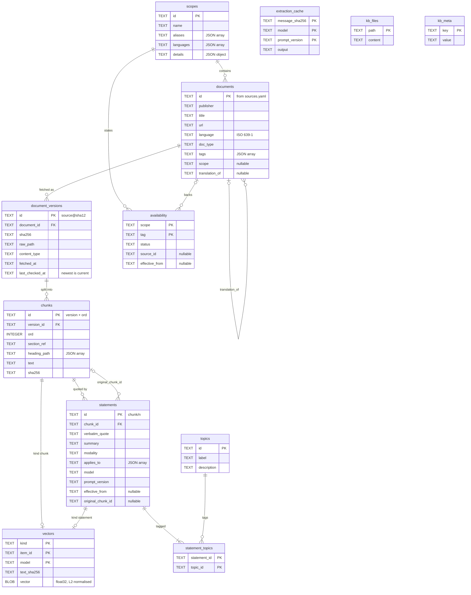
```mermaid
erDiagram
    documents ||--o{ document_versions : "fetched as"
    document_versions ||--o{ chunks : "split into"
    chunks ||--o{ statements : "quoted by"
    statements ||--|{ statement_topics : "tagged"
    topics ||--o{ statement_topics : "tags"
    scopes ||--o{ documents : "contains"
    scopes ||--o{ availability : "states"
    documents |o--o{ availability : "backs"
    documents |o--o{ documents : "translation_of"
    chunks |o--o{ statements : "original_chunk_id"
    chunks ||--o| vectors : "kind chunk"
    statements ||--o| vectors : "kind statement"

    documents {
        TEXT id PK "from sources.yaml"
        TEXT publisher
        TEXT title
        TEXT url
        TEXT language "ISO 639-1"
        TEXT doc_type
        TEXT tags "JSON array"
        TEXT scope "nullable"
        TEXT translation_of "nullable"
    }
    document_versions {
        TEXT id PK "source@sha12"
        TEXT document_id FK
        TEXT sha256
        TEXT raw_path
        TEXT content_type
        TEXT fetched_at
        TEXT last_checked_at "newest is current"
    }
    chunks {
        TEXT id PK "version + ord"
        TEXT version_id FK
        INTEGER ord
        TEXT section_ref
        TEXT heading_path "JSON array"
        TEXT text
        TEXT sha256
    }
    statements {
        TEXT id PK "chunk/n"
        TEXT chunk_id FK
        TEXT verbatim_quote
        TEXT summary
        TEXT modality
        TEXT applies_to "JSON array"
        TEXT model
        TEXT prompt_version
        TEXT effective_from "nullable"
        TEXT original_chunk_id "nullable"
    }
    extraction_cache {
        TEXT message_sha256 PK
        TEXT model PK
        TEXT prompt_version PK
        TEXT output
    }
    topics {
        TEXT id PK
        TEXT label
        TEXT description
    }
    statement_topics {
        TEXT statement_id PK
        TEXT topic_id PK
    }
    scopes {
        TEXT id PK
        TEXT name
        TEXT aliases "JSON array"
        TEXT languages "JSON array"
        TEXT details "JSON object"
    }
    availability {
        TEXT scope PK
        TEXT tag PK
        TEXT status
        TEXT source_id "nullable"
        TEXT effective_from "nullable"
    }
    vectors {
        TEXT kind PK
        TEXT item_id PK
        TEXT model PK
        TEXT text_sha256
        BLOB vector "float32, L2-normalised"
    }
    kb_files {
        TEXT path PK
        TEXT content
    }
    kb_meta {
        TEXT key PK
        TEXT value
    }
```

Identifiers are built from their parents, so a citation stays readable:

| Row | Id recipe | Example |
|---|---|---|
| document | the `id` in `sources.yaml` | `gb-gambling-act-2005` |
| version | `<source>@<sha256[:12]>` (`fetch.store`) | `gb-gambling-act-2005@0123456789ab` |
| chunk | `<version>#<ord:04d>` (`parse.store`) | `...@0123456789ab#0042` |
| statement | `<chunk>/<n>`, n counts kept records from 1 (`statements._store`) | `...#0042/3` |

**The current version** of a document is the version with the latest
`last_checked_at` (ties broken by `fetched_at`). The same rule appears in
`fetch.store`, `parse.current_version` and `index.CURRENT_VERSIONS`. Parse,
extract, index and search only ever look at the current version; older
versions and their chunks stay in the database untouched.

| Kind | Tables |
|---|---|
| source of truth | `documents`, `document_versions`, `chunks`, `statements`, `statement_topics`, `topics`, `scopes`, `availability` |
| cache (deleting costs model calls only) | `extraction_cache` |
| derived, rebuilt by `kb index` | `chunks_fts`, `statements_fts`, `vectors` |
| filled only in a published snapshot | `kb_files`, `kb_meta` |

`db.connect` creates the file, applies `schema.sql` (every statement is
`CREATE ... IF NOT EXISTS`, so new tables appear in old files) and adds the
columns listed in `db.ADDED_COLUMNS` to older files. There is no migration
table; `kb_meta.schema` exists only for publish and pull.

## 5. Command dispatch

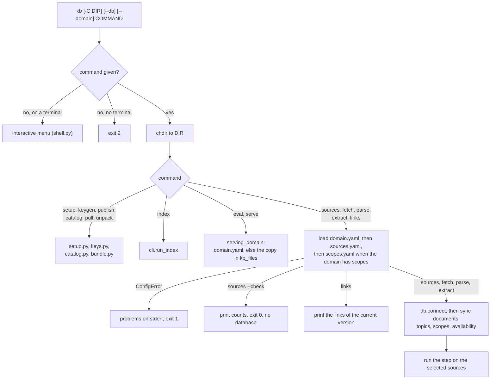
```mermaid
flowchart TD
    A["kb [-C DIR] [--db] [--domain] COMMAND"] --> B{"command given?"}
    B -->|"no, on a terminal"| SH["interactive menu (shell.py)"]
    B -->|"no, no terminal"| X2["exit 2"]
    B -->|"yes"| C["chdir to DIR"]
    C --> D{"command"}
    D -->|"setup, keygen, publish,<br/>catalog, pull, unpack"| SHARE["setup.py, keys.py,<br/>catalog.py, bundle.py"]
    D -->|"index"| IDX["cli.run_index"]
    D -->|"eval, serve"| SD["serving_domain:<br/>domain.yaml, else the copy in kb_files"]
    D -->|"sources, fetch, parse,<br/>extract, links"| REG["load domain.yaml, then sources.yaml,<br/>then scopes.yaml when the domain has scopes"]
    REG -->|"ConfigError"| X1["problems on stderr, exit 1"]
    REG -->|"sources --check"| OKC["print counts, exit 0, no database"]
    REG -->|"links"| LNK["print the links of the current version"]
    REG -->|"sources, fetch, parse, extract"| SYNC["db.connect, then sync documents,<br/>topics, scopes, availability"]
    SYNC --> STEP["run the step on the selected sources"]
```

`--source ID` narrows fetch, parse and extract; the sync always covers the
whole registry.

## 6. Configuration loading and sync

Each loader reads YAML with `yaml.safe_load`, collects every problem it finds
and raises one `ConfigError` listing them all, so one run shows every mistake.

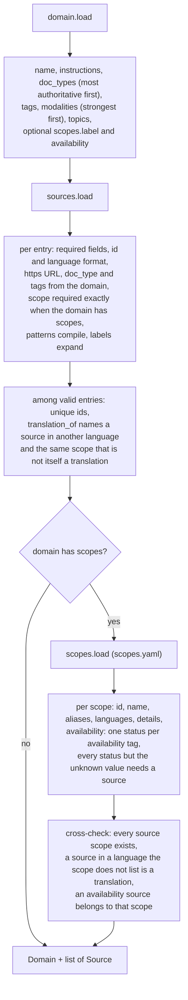
```mermaid
flowchart TD
    D0["domain.load"] --> D1["name, instructions, doc_types (most authoritative first),<br/>tags, modalities (strongest first), topics,<br/>optional scopes.label and availability"]
    D1 --> S0["sources.load"]
    S0 --> S1["per entry: required fields, id and language format,<br/>https URL, doc_type and tags from the domain,<br/>scope required exactly when the domain has scopes,<br/>patterns compile, labels expand"]
    S1 --> S2["among valid entries: unique ids,<br/>translation_of names a source in another language<br/>and the same scope that is not itself a translation"]
    S2 --> Q{"domain has scopes?"}
    Q -->|"no"| DONE["Domain + list of Source"]
    Q -->|"yes"| SC0["scopes.load (scopes.yaml)"]
    SC0 --> SC1["per scope: id, name, aliases, languages, details,<br/>availability: one status per availability tag,<br/>every status but the unknown value needs a source"]
    SC1 --> SC2["cross-check: every source scope exists,<br/>a source in a language the scope does not list is a translation,<br/>an availability source belongs to that scope"]
    SC2 --> DONE
```

| Sync step | Table effect | Deletes |
|---|---|---|
| `sources.sync` | upsert `documents` | never; ids no longer in `sources.yaml` are reported as a warning |
| `statements.sync_topics` | upsert `topics` | never |
| `scopes.sync` | replace `scopes` and `availability` | both tables are emptied and refilled |

Parse settings (`section_pattern`, `body_start`, `skip_classes`, ...) and
`extract_note` live only in `sources.yaml`; they never reach the database.

## 7. Lifecycle of a source

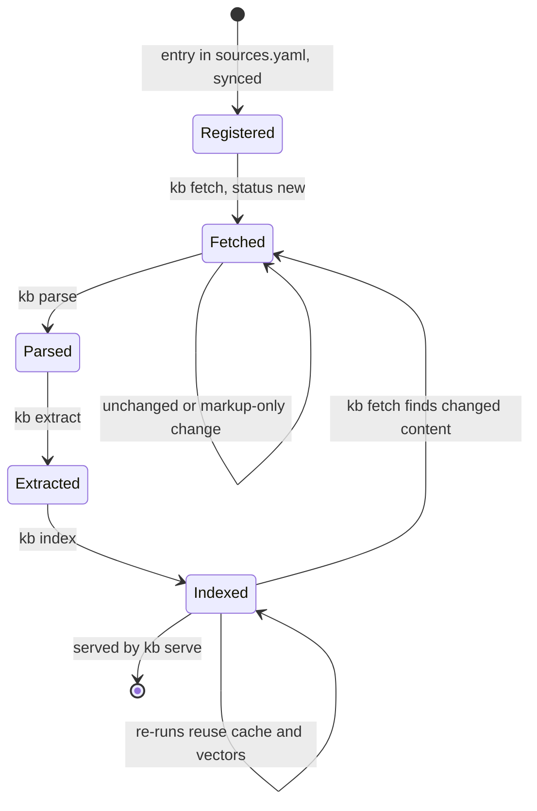
```mermaid
stateDiagram-v2
    [*] --> Registered: entry in sources.yaml, synced
    Registered --> Fetched: kb fetch, status new
    Fetched --> Fetched: unchanged or markup-only change
    Fetched --> Parsed: kb parse
    Parsed --> Extracted: kb extract
    Extracted --> Indexed: kb index
    Indexed --> Indexed: re-runs reuse cache and vectors
    Indexed --> Fetched: kb fetch finds changed content
    Indexed --> [*]: served by kb serve
```

A changed download becomes the current version with no chunks of its own.
Because search reads only current versions, the document drops out of search
until `kb parse`, `kb extract` and `kb index` have run for it. `setup NAME` and
`downloads/ingest.sh` always run the whole chain.

## 8. Fetch

### 8.1 One source

`fetch.fetch_all` handles the sources one after another.

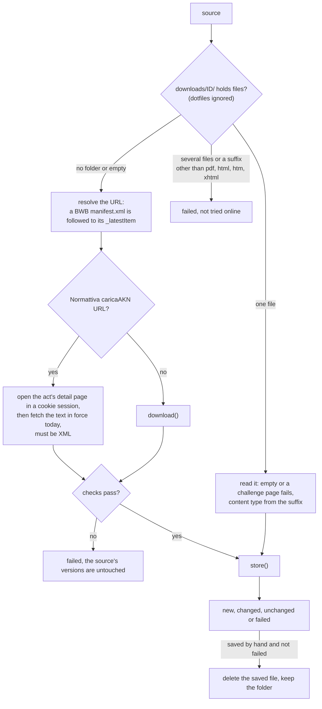
```mermaid
flowchart TD
    A["source"] --> B{"downloads/ID/ holds files?<br/>(dotfiles ignored)"}
    B -->|"no folder or empty"| R["resolve the URL:<br/>a BWB manifest.xml is followed to its _latestItem"]
    B -->|"several files or a suffix<br/>other than pdf, html, htm, xhtml"| F1["failed, not tried online"]
    B -->|"one file"| H["read it: empty or a challenge page fails,<br/>content type from the suffix"]
    R --> N{"Normattiva caricaAKN URL?"}
    N -->|"yes"| NA["open the act's detail page in a cookie session,<br/>then fetch the text in force today,<br/>must be XML"]
    N -->|"no"| DL["download()"]
    NA --> CK{"checks pass?"}
    DL --> CK
    CK -->|"no"| F2["failed, the source's versions are untouched"]
    CK -->|"yes"| ST["store()"]
    H --> ST
    ST --> OUT["new, changed, unchanged or failed"]
    OUT -->|"saved by hand and not failed"| RM["delete the saved file, keep the folder"]
```

`download()` sends a `User-Agent`, `Accept-Language: *` and, for `www.boe.es`,
`Accept: application/xml`. TLS uses the operating system's trust store; the
timeout is 60 seconds. It fails, in this order, on:

1. a redirect to a non-https URL,
2. an HTTP error (marked as a Cloudflare challenge when `cf-mitigated` says so),
3. a network error,
4. a body over 50 MiB,
5. an AWS WAF challenge (`x-amzn-waf-action`),
6. an empty body,
7. a body shorter than its `Content-Length`,
8. a Cloudflare challenge served with status 200,
9. a Cloudflare or Anubis challenge script in the body.

### 8.2 Storing a download

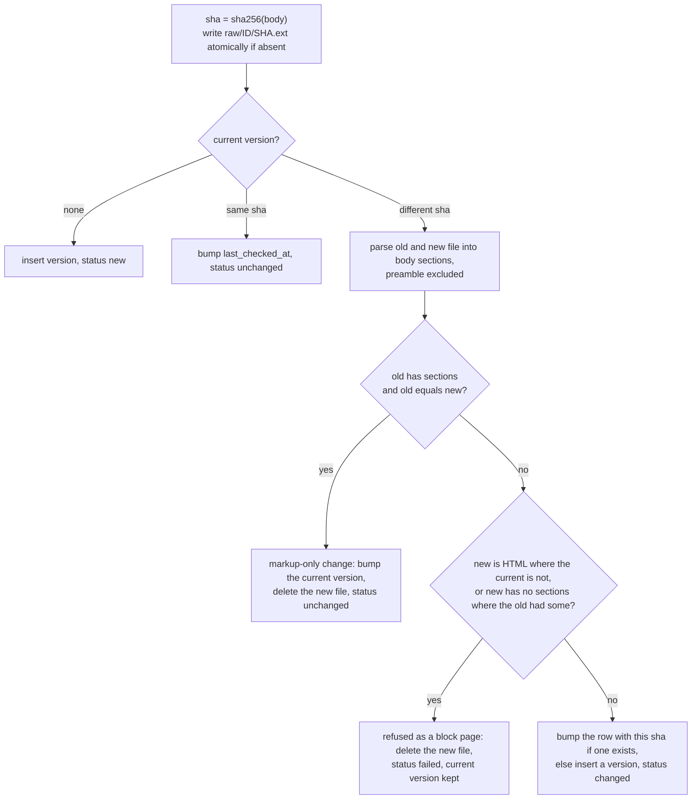
```mermaid
flowchart TD
    S0["sha = sha256(body)<br/>write raw/ID/SHA.ext atomically if absent"] --> S1{"current version?"}
    S1 -->|"none"| INS["insert version, status new"]
    S1 -->|"same sha"| UPD["bump last_checked_at, status unchanged"]
    S1 -->|"different sha"| CMP["parse old and new file into body sections,<br/>preamble excluded"]
    CMP --> M{"old has sections<br/>and old equals new?"}
    M -->|"yes"| MK["markup-only change: bump the current version,<br/>delete the new file, status unchanged"]
    M -->|"no"| BL{"new is HTML where the current is not,<br/>or new has no sections where the old had some?"}
    BL -->|"yes"| REF["refused as a block page: delete the new file,<br/>status failed, current version kept"]
    BL -->|"no"| CHG["bump the row with this sha if one exists,<br/>else insert a version, status changed"]
```

The file is written before the database, under a name that is its hash, so
nothing is ever overwritten. A sha that matches an older version makes that
version current again.

### 8.3 Downloading by hand

When sources fail, `kb fetch` prepares a loop the user finishes in a browser.

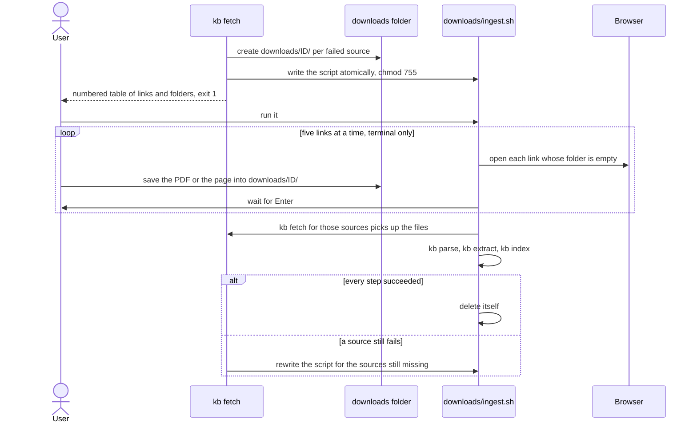
```mermaid
sequenceDiagram
    actor U as User
    participant F as kb fetch
    participant DL as downloads folder
    participant SH as downloads/ingest.sh
    participant B as Browser
    F->>DL: create downloads/ID/ per failed source
    F->>SH: write the script atomically, chmod 755
    F-->>U: numbered table of links and folders, exit 1
    U->>SH: run it
    loop five links at a time, terminal only
        SH->>B: open each link whose folder is empty
        U->>DL: save the PDF or the page into downloads/ID/
        SH->>U: wait for Enter
    end
    SH->>F: kb fetch for those sources picks up the files
    SH->>SH: kb parse, kb extract, kb index
    alt every step succeeded
        SH->>SH: delete itself
    else a source still fails
        F->>SH: rewrite the script for the sources still missing
    end
```

## 9. Parse

### 9.1 One source

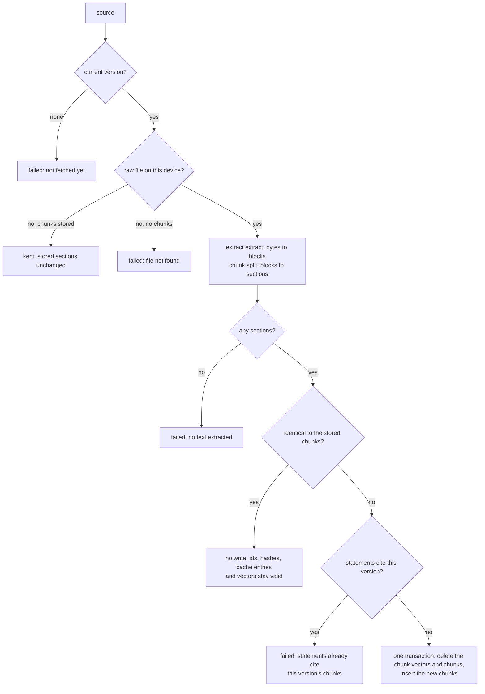
```mermaid
flowchart TD
    P0["source"] --> P1{"current version?"}
    P1 -->|"none"| PF1["failed: not fetched yet"]
    P1 -->|"yes"| P2{"raw file on this device?"}
    P2 -->|"no, chunks stored"| PK["kept: stored sections unchanged"]
    P2 -->|"no, no chunks"| PF2["failed: file not found"]
    P2 -->|"yes"| P3["extract.extract: bytes to blocks<br/>chunk.split: blocks to sections"]
    P3 --> P4{"any sections?"}
    P4 -->|"no"| PF3["failed: no text extracted"]
    P4 -->|"yes"| P6{"identical to the stored chunks?"}
    P6 -->|"yes"| PN["no write: ids, hashes, cache entries<br/>and vectors stay valid"]
    P6 -->|"no"| P7{"statements cite this version?"}
    P7 -->|"yes"| PF4["failed: statements already cite<br/>this version's chunks"]
    P7 -->|"no"| P8["one transaction: delete the chunk vectors and chunks,<br/>insert the new chunks"]
```

Re-chunking a cited version needs the statements deleted first (the README
shows the SQL); the refusal protects citations from pointing at the wrong text.

### 9.2 Readers

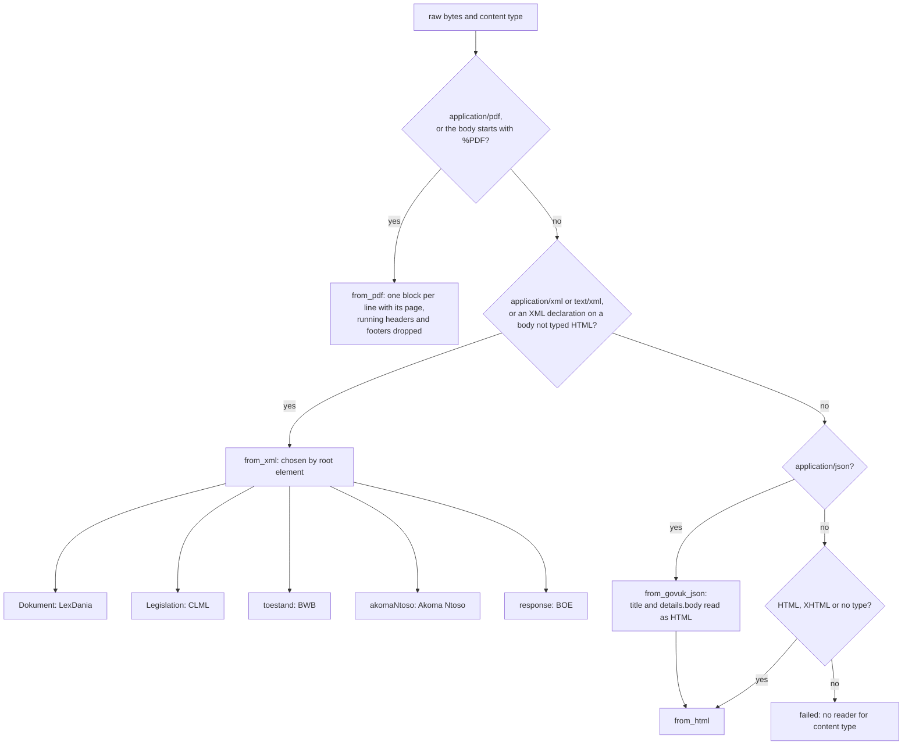
```mermaid
flowchart TD
    X0["raw bytes and content type"] --> X1{"application/pdf,<br/>or the body starts with %PDF?"}
    X1 -->|"yes"| PDF["from_pdf: one block per line with its page,<br/>running headers and footers dropped"]
    X1 -->|"no"| X2{"application/xml or text/xml,<br/>or an XML declaration on a body not typed HTML?"}
    X2 -->|"yes"| XML["from_xml: chosen by root element"]
    X2 -->|"no"| X3{"application/json?"}
    X3 -->|"yes"| JS["from_govuk_json:<br/>title and details.body read as HTML"]
    X3 -->|"no"| X4{"HTML, XHTML or no type?"}
    X4 -->|"yes"| HT["from_html"]
    X4 -->|"no"| ERR["failed: no reader for content type"]
    JS --> HT
    XML --> R1["Dokument: LexDania"]
    XML --> R2["Legislation: CLML"]
    XML --> R3["toestand: BWB"]
    XML --> R4["akomaNtoso: Akoma Ntoso"]
    XML --> R5["response: BOE"]
```

`from_html` reads `<main>`, else `<body>` (only the ASP.NET page form when the
page has one). It skips `script`, `style`, `nav`, `header`, `footer`, `aside`,
forms, buttons, hidden elements, anything whose class or id mentions `cookie`,
and every element with a class from `skip_classes`. Headings keep their level,
and lines inside `<blockquote>` are marked as quoted. HTML is decoded with the
charset its `<meta>` tag declares, else UTF-8, else windows-1252.

The XML readers mark each section start themselves:

| Root element | Source | Section refs |
|---|---|---|
| `Dokument` | LexDania, retsinformation.dk | `§ 4` |
| `Legislation` | CLML, legislation.gov.uk | `s. 65`, `Sch. 18 para. 9` |
| `toestand` | BWB, wetten.overheid.nl | `Artikel 1`; repealed articles dropped |
| `akomaNtoso` | Akoma Ntoso, Finlex and Normattiva | the article number |
| `response` | BOE | the article title, latest version; `Anexo 3.1` |

### 9.3 Splitting into sections

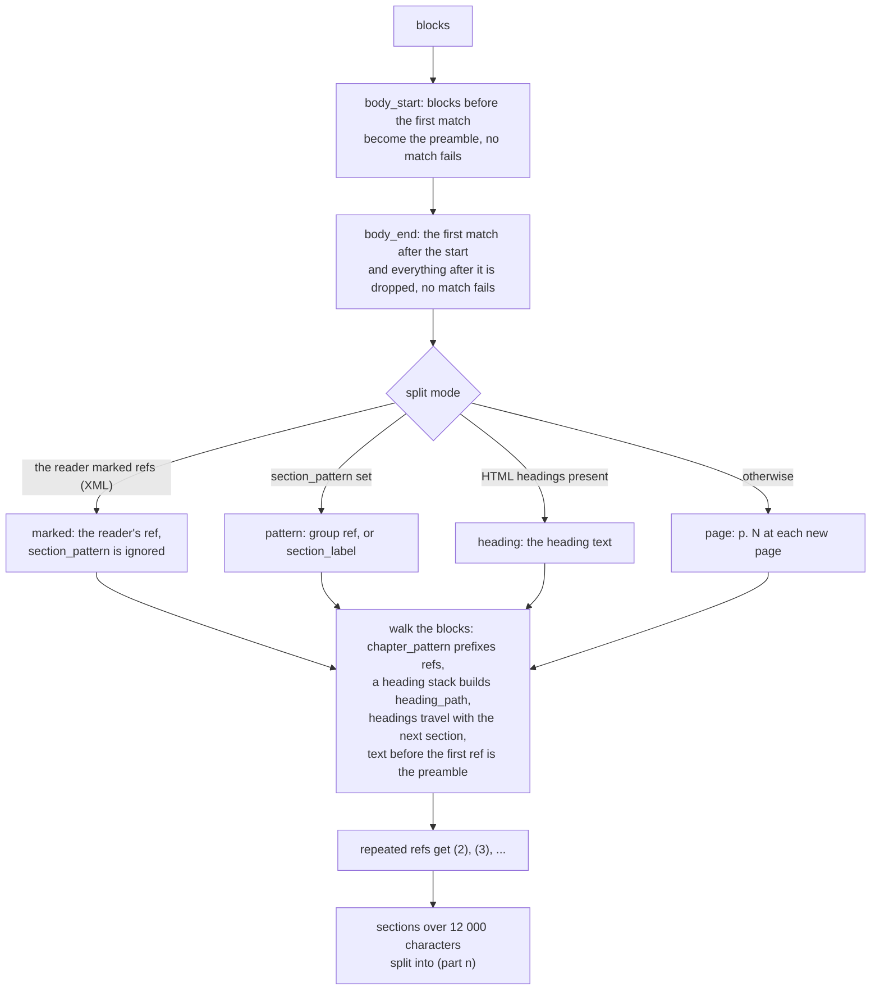
```mermaid
flowchart TD
    C0["blocks"] --> C1["body_start: blocks before the first match<br/>become the preamble, no match fails"]
    C1 --> C2["body_end: the first match after the start<br/>and everything after it is dropped, no match fails"]
    C2 --> C3{"split mode"}
    C3 -->|"the reader marked refs (XML)"| M1["marked: the reader's ref,<br/>section_pattern is ignored"]
    C3 -->|"section_pattern set"| M2["pattern: group ref, or section_label"]
    C3 -->|"HTML headings present"| M3["heading: the heading text"]
    C3 -->|"otherwise"| M4["page: p. N at each new page"]
    M1 & M2 & M3 & M4 --> C4["walk the blocks: chapter_pattern prefixes refs,<br/>a heading stack builds heading_path,<br/>headings travel with the next section,<br/>text before the first ref is the preamble"]
    C4 --> C5["repeated refs get (2), (3), ..."]
    C5 --> C6["sections over 12 000 characters<br/>split into (part n)"]
```

Patterns see headings in Markdown form (`## 1. Introduction`) and quoted lines
with a `> ` prefix; the stored text has neither. An HTML page without headings
and without a `section_pattern` becomes a single `(preamble)` chunk, which
extraction skips, so such a source needs a pattern.

## 10. Extract

### 10.1 The run

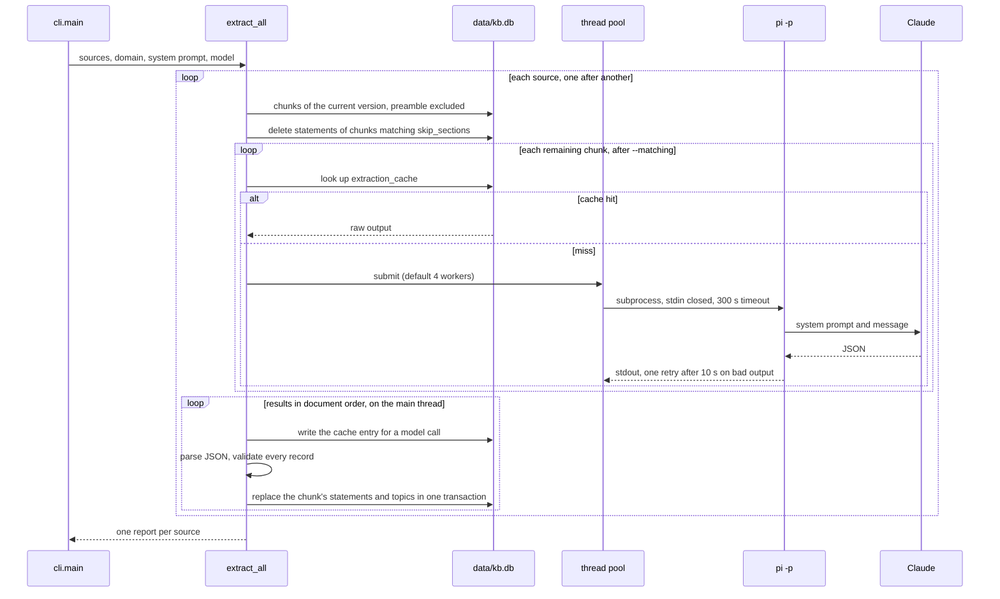
```mermaid
sequenceDiagram
    participant CLI as cli.main
    participant X as extract_all
    participant DB as data/kb.db
    participant POOL as thread pool
    participant PI as pi -p
    participant M as Claude
    CLI->>X: sources, domain, system prompt, model
    loop each source, one after another
        X->>DB: chunks of the current version, preamble excluded
        X->>DB: delete statements of chunks matching skip_sections
        loop each remaining chunk, after --matching
            X->>DB: look up extraction_cache
            alt cache hit
                DB-->>X: raw output
            else miss
                X->>POOL: submit (default 4 workers)
                POOL->>PI: subprocess, stdin closed, 300 s timeout
                PI->>M: system prompt and message
                M-->>PI: JSON
                PI-->>POOL: stdout, one retry after 10 s on bad output
            end
        end
        loop results in document order, on the main thread
            X->>DB: write the cache entry for a model call
            X->>X: parse JSON, validate every record
            X->>DB: replace the chunk's statements and topics in one transaction
        end
    end
    X-->>CLI: one report per source
```

`pi` runs as `pi -p --no-session --no-tools --no-extensions --no-skills
--no-prompt-templates --no-context-files --no-themes --no-approve --thinking
off`, so only the prompt and the section reach the model. The one extension
loaded is `@gotgenes/pi-anthropic-auth` when installed (`KB_PI_EXTENSIONS`
replaces the list); `KB_PI_PREFIX` wraps the command, for example in a sandbox.
Setting `KB_PI_PREFIX=false` makes every model call fail, which proves a run is
served entirely from the cache.

Only SQLite work happens on the main thread; the workers only call the model.
Each chunk commits on its own, so an interrupted run keeps its progress and the
next run hits the cache.

### 10.2 Prompt and cache key

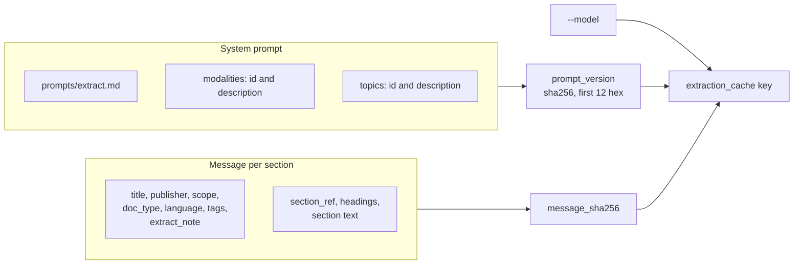
```mermaid
flowchart LR
    subgraph sys["System prompt"]
        E["prompts/extract.md"]
        MO["modalities: id and description"]
        TO["topics: id and description"]
    end
    subgraph msg["Message per section"]
        DOC["title, publisher, scope,<br/>doc_type, language, tags,<br/>extract_note"]
        SEC["section_ref, headings,<br/>section text"]
    end
    sys --> PV["prompt_version<br/>sha256, first 12 hex"]
    msg --> MS["message_sha256"]
    MODEL["--model"] --> K
    PV --> K["extraction_cache key"]
    MS --> K
```

Changing the prompt file, a modality or a topic description changes
`prompt_version` and makes every cached output stale: the next run calls the
model for every section. Changing a source's metadata or a section's text or
headings misses the cache for that source or section only. Topic labels and the
domain `instructions` are not part of the key.

### 10.3 Validating a record

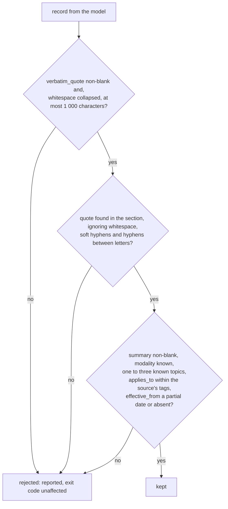
```mermaid
flowchart TD
    V0["record from the model"] --> V1{"verbatim_quote non-blank and,<br/>whitespace collapsed, at most 1 000 characters?"}
    V1 -->|"no"| RJ["rejected: reported, exit code unaffected"]
    V1 -->|"yes"| V2{"quote found in the section, ignoring whitespace,<br/>soft hyphens and hyphens between letters?"}
    V2 -->|"no"| RJ
    V2 -->|"yes"| V3{"summary non-blank, modality known,<br/>one to three known topics,<br/>applies_to within the source's tags,<br/>effective_from a partial date or absent?"}
    V3 -->|"no"| RJ
    V3 -->|"yes"| OK["kept"]
```

The hyphen rule exists because PDF text breaks words at line ends; digits keep
their hyphens, so `2-3` never matches `23`. The prompts ask for quotes of at
most 600 characters; the code allows 1 000 because long sentences run over.

### 10.4 Outcomes per chunk

| Outcome | Effect on the chunk's statements |
|---|---|
| output parsed, some records kept | replaced by the kept records |
| output parsed, every record rejected | cleared |
| model call failed twice, timeout, `pi` missing | unchanged; the section is reported as failed |
| filtered out by `--matching` | unchanged, even if made with an older prompt |
| matched by `skip_sections` | deleted; the chunk stays searchable |

`kb extract` exits 1 when any section failed; rejected records never change
the exit code.

### 10.5 Translations

For a source with `translation_of`, each statement records the chunk of the
original with the same numbering. `ref_key` reduces a ref to its numbers and
single lower-case letters (`s. 65(2)(a)` becomes `65, 2, a`); a statement is
mapped only when that key is unique in the original's current version,
otherwise `original_chunk_id` stays empty.

## 11. Index

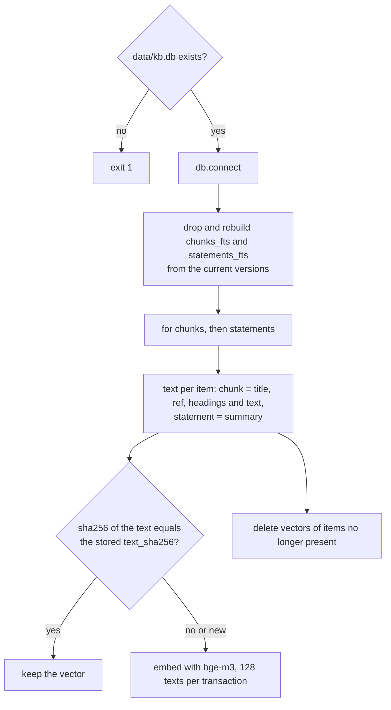
```mermaid
flowchart TD
    I0{"data/kb.db exists?"} -->|"no"| IE["exit 1"]
    I0 -->|"yes"| I1["db.connect"]
    I1 --> I2["drop and rebuild chunks_fts and statements_fts<br/>from the current versions"]
    I2 --> I3["for chunks, then statements"]
    I3 --> I4["text per item: chunk = title, ref, headings and text,<br/>statement = summary"]
    I4 --> I5{"sha256 of the text equals<br/>the stored text_sha256?"}
    I5 -->|"yes"| I6["keep the vector"]
    I5 -->|"no or new"| I7["embed with bge-m3, 128 texts per transaction"]
    I4 --> I8["delete vectors of items no longer present"]
```

| Index | Columns | Tokenizer |
|---|---|---|
| `chunks_fts` | `chunk_id` (unindexed), `heading` (ref and headings), `text` | `unicode61 remove_diacritics 2` |
| `statements_fts` | `statement_id` (unindexed), `summary`, `verbatim_quote` | same |

The full-text tables are rebuilt in full on every run; vectors are
incremental. Embeddings are L2-normalised float32 blobs, so cosine similarity
is a dot product. Texts are truncated at 1 024 tokens for embedding only.

## 12. Search and the MCP server

### 12.1 Serving

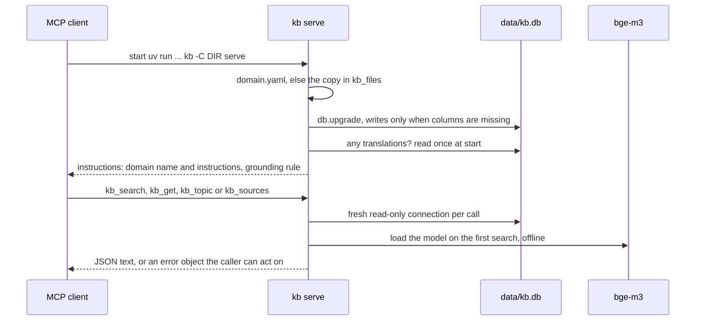
```mermaid
sequenceDiagram
    participant C as MCP client
    participant K as kb serve
    participant DB as data/kb.db
    participant E as bge-m3
    C->>K: start uv run ... kb -C DIR serve
    K->>K: domain.yaml, else the copy in kb_files
    K->>DB: db.upgrade, writes only when columns are missing
    K->>DB: any translations? read once at start
    K-->>C: instructions: domain name and instructions, grounding rule
    C->>K: kb_search, kb_get, kb_topic or kb_sources
    K->>DB: fresh read-only connection per call
    K->>E: load the model on the first search, offline
    K-->>C: JSON text, or an error object the caller can act on
```

The tools are annotated read-only and idempotent. The server name is always
`kb`; the client prefixes the tools with the name it registered the server
under, so several knowledge bases never collide. The vector matrices are cached
in memory and reloaded when the `vectors` table changes, so a re-index needs no
restart.

### 12.2 kb_search

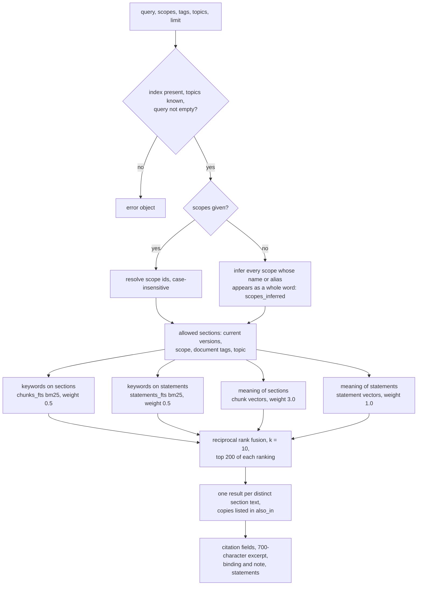
```mermaid
flowchart TD
    Q["query, scopes, tags, topics, limit"] --> Q1{"index present, topics known,<br/>query not empty?"}
    Q1 -->|"no"| QE["error object"]
    Q1 -->|"yes"| Q2{"scopes given?"}
    Q2 -->|"yes"| Q3["resolve scope ids, case-insensitive"]
    Q2 -->|"no"| Q4["infer every scope whose name or alias<br/>appears as a whole word: scopes_inferred"]
    Q3 & Q4 --> Q5["allowed sections: current versions,<br/>scope, document tags, topic"]
    Q5 --> R1["keywords on sections<br/>chunks_fts bm25, weight 0.5"]
    Q5 --> R2["keywords on statements<br/>statements_fts bm25, weight 0.5"]
    Q5 --> R3["meaning of sections<br/>chunk vectors, weight 3.0"]
    Q5 --> R4["meaning of statements<br/>statement vectors, weight 1.0"]
    R1 & R2 & R3 & R4 --> F["reciprocal rank fusion, k = 10,<br/>top 200 of each ranking"]
    F --> D["one result per distinct section text,<br/>copies listed in also_in"]
    D --> O["citation fields, 700-character excerpt,<br/>binding and note, statements"]
```

The fused score of a section $s$ over the rankings $r$ that contain it is

$$\mathrm{score}(s) = \sum_{r} \frac{w_r}{10 + \mathrm{rank}_r(s)}$$

with $w$ = 0.5, 0.5, 3.0 and 1.0 as above. A small $k$ lets a first place in
one ranking outweigh middling places in several. The keyword query keeps words
longer than one letter that are neither stop words nor words of a scope name or
alias, matches words of four letters or more as prefixes, and joins them with
`OR`. Without vectors, search falls back to keywords and says so in a `note`;
with no result it returns a note telling the agent not to fill the gap from
memory.

Every section carries `source_id`, `section_ref`, `url`, `version` and
`fetched_at`. When the domain has non-binding doc types or the source is a
translation, it also carries `binding` and a `note`; a translation's statements
carry `original_section`.

### 12.3 kb_get, kb_topic, kb_sources

- **kb_get** returns one section in full, joining its `(part n)` chunks. An
  unknown ref returns an error listing up to 15 refs of the same document that
  contain its first number, or the document's first refs when none do.
- **kb_sources** lists every document with version, fetch date, tags and
  counts, the topic ids, and each scope's details and availability.
- **kb_topic** collects every statement on one topic:

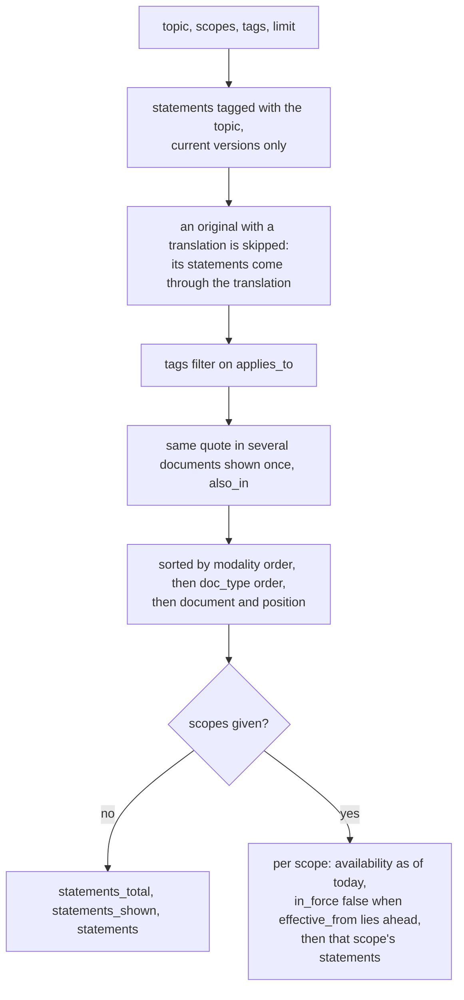
```mermaid
flowchart TD
    T0["topic, scopes, tags, limit"] --> T1["statements tagged with the topic,<br/>current versions only"]
    T1 --> T2["an original with a translation is skipped:<br/>its statements come through the translation"]
    T2 --> T3["tags filter on applies_to"]
    T3 --> T4["same quote in several documents shown once, also_in"]
    T4 --> T5["sorted by modality order, then doc_type order,<br/>then document and position"]
    T5 --> T6{"scopes given?"}
    T6 -->|"no"| T7["statements_total, statements_shown, statements"]
    T6 -->|"yes"| T8["per scope: availability as of today,<br/>in_force false when effective_from lies ahead,<br/>then that scope's statements"]
```

## 13. Eval

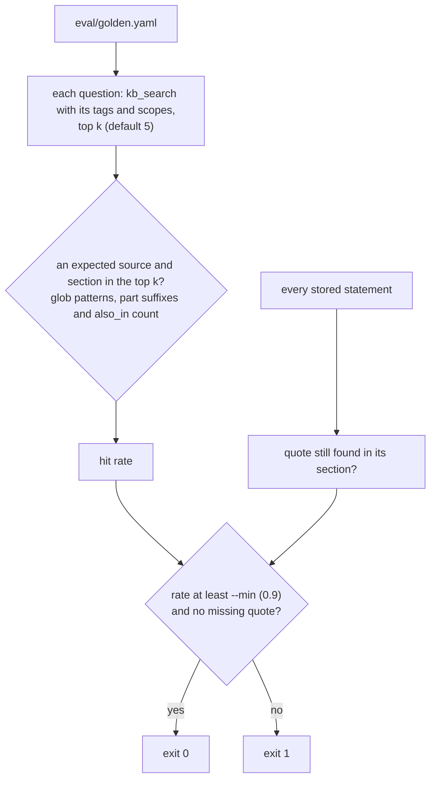
```mermaid
flowchart TD
    G0["eval/golden.yaml"] --> G1["each question: kb_search with its tags and scopes,<br/>top k (default 5)"]
    G1 --> G2{"an expected source and section in the top k?<br/>glob patterns, part suffixes and also_in count"}
    G2 --> G3["hit rate"]
    DBQ["every stored statement"] --> G4["quote still found in its section?"]
    G3 & G4 --> G5{"rate at least --min (0.9)<br/>and no missing quote?"}
    G5 -->|"yes"| G6["exit 0"]
    G5 -->|"no"| G7["exit 1"]
```

A miss prints the top three results, which is usually enough to tell a parse
problem (wrong section boundaries) from a ranking problem.

## 14. setup NAME

```mermaid
flowchart TD
    S0["setup NAME, optional --dir"] --> S1{"valid name?"}
    S1 -->|"no"| SX["exit 1"]
    S1 -->|"yes"| S2{"domain.yaml in the directory?<br/>default ~/kbs/NAME"}
    S2 -->|"no: create"| C1["ask what the knowledge base is about"]
    C1 --> C2["copy each template file that does not exist yet,<br/>filling in name, instructions and topic"]
    C2 --> C3[".gitignore for data/, raw/, downloads/"]
    C3 --> C4["offer git init"]
    C4 --> C5["exit 0: fill in the files, run setup NAME again"]
    S2 -->|"yes: build"| B1["kb sources --check"]
    B1 -->|"problems"| SX
    B1 -->|"valid"| B2["kb fetch, kb parse, kb extract<br/>failures recorded, later steps still run"]
    B2 --> B3["kb index"]
    B3 -->|"fails"| B4["exit 1, not registered"]
    B3 -->|"succeeds"| B5["offer MCP registration in ~/.omp/agent/mcp.json,<br/>an identical entry is left alone"]
    B5 --> B6{"golden set with valid questions?"}
    B6 -->|"no"| B7["eval skipped"]
    B6 -->|"yes"| B8["kb eval"]
    B7 & B8 --> B9["exit 1 if a step failed, else 0"]
```

The registered entry runs `uv run --project <engine checkout> --quiet kb -C
<directory> serve` with a 120-second timeout, because the first search loads
the embedding model. Without a terminal, `setup` never registers and never
creates a repository.

## 15. Sharing: publish, catalog, pull

### 15.1 What a bundle holds

```mermaid
flowchart LR
    SRC["data/kb.db"] -->|"VACUUM INTO, source opened read-only"| SNAP["snapshot in the system temp directory"]
    SNAP --> KEEP["kept: documents, document_versions, chunks,<br/>statements, statement_topics, extraction_cache,<br/>topics, scopes, availability"]
    SNAP --> DROP["dropped: chunks_fts, statements_fts<br/>emptied: vectors"]
    SNAP --> FILL["kb_files: domain.yaml, sources.yaml, scopes.yaml,<br/>prompts/, eval/<br/>kb_meta: schema, name, version, published_at"]
    KEEP & DROP & FILL --> Z["zstd, level 19"]
    Z --> A["age, encrypted to every key in recipients.txt"]
    A --> OUT["NAME-vN.kb.zst.age"]
```

The `content_sha256` in the manifest is taken after `VACUUM` and before
`kb_meta` is stamped, so two snapshots of the same content hash the same. Raw
downloads never leave the device.

### 15.2 Catalog layout

```text
CATALOG/
  .git/                          git catalog only
  NAME/
    manifest.json                format, name, version, published_at, private, title,
                                 counts, content_sha256, recipients, bundle {file, sha256, size},
                                 release {repo, tag}  (git catalog only)
    recipients.txt               age public keys, one per line, comments kept
    NAME-vN.kb.zst.age           folder catalog only, newest version only
    domain.yaml sources.yaml ... public knowledge bases only, a readable copy of the configuration
```

```mermaid
flowchart LR
    L0{"--catalog given?"} -->|"yes"| L1["use it"]
    L0 -->|"no"| L2{"KB_CATALOG set?"}
    L2 -->|"yes"| L3["use it"]
    L2 -->|"no"| L4{"~/.config/kb/catalog saved?"}
    L4 -->|"yes"| L5["use the saved path"]
    L4 -->|"no"| L6["publish, catalog and pull<br/>require --catalog"]
```

### 15.3 Publish

```mermaid
sequenceDiagram
    actor U as User
    participant P as kb publish
    participant C as Catalog
    participant GH as gh, GitHub
    U->>P: kb -C DIR publish, optional --recipient, --revoke, --private
    P->>C: git pull --ff-only (git catalog, failure only warns)
    P->>C: read NAME/manifest.json and recipients.txt
    P->>P: recipients: listed keys, your own key, added keys, minus revoked
    P->>P: snapshot and content_sha256
    alt content, recipients and privacy as in the last version
        P-->>U: unchanged, nothing uploaded
    else something changed
        P->>P: stamp kb_meta with version N, compress, encrypt
        alt git catalog
            P->>GH: gh release create NAME-vN with the bundle
        else folder catalog
            P->>C: bundle beside the manifest
        end
        P->>C: manifest.json, recipients.txt, readable configuration unless private
        P->>C: swap the staged entry into place
        opt git catalog
            P->>C: git add, commit Publish NAME vN, push
        end
        P-->>U: published NAME vN
    end
```

Your own key is always a recipient and cannot be revoked. `--private` stays in
force for later versions until `--no-private`. The version number belongs to
the catalog, so two devices publishing the same name replace each other's work.

### 15.4 Pull

```mermaid
sequenceDiagram
    actor U as User
    participant P as kb pull NAME
    participant C as Catalog
    participant GH as gh, GitHub
    participant H as target directory
    U->>P: kb pull NAME, optional --dir, --force
    P->>C: git pull, read manifest.json
    P->>H: refuse when domain.yaml exists and --force is absent
    alt manifest names a release
        P->>GH: gh release download NAME-vN
    else folder catalog
        P->>C: use the bundle beside the manifest
    end
    P->>P: sha256 must match the manifest
    P->>P: decrypt with your identity, decompress, SQLite quick_check
    P->>P: kb_meta name and version match, schema not newer than the engine
    P->>P: configuration paths limited to known files, prompts/ and eval/
    P->>P: copy vectors and extraction_cache from the installed database
    P->>H: replace data/kb.db, write the configuration files
    P->>H: kb index, a failure only warns
    P->>U: offer MCP registration
```

Copying the old vectors into the new snapshot is what makes an update take
seconds: `kb index` re-embeds only sections and statements whose text changed.
`raw/` and local files the bundle does not name are left alone.

## 16. Interactive menu

```mermaid
flowchart LR
    H["kb"] --> K["a knowledge base<br/>~/kbs/* and registered kb servers"]
    K --> K1["check, build, fetch, parse,<br/>extract, index, eval, register"]
    K --> K2["publish, with a catalog connected"]
    H --> N["+ new: setup NAME"]
    H --> CT["catalog"]
    CT --> CE["published entry"]
    CE --> CE1["install, update or reinstall<br/>never over a knowledge base built here"]
    CE --> CE2["publish, share, revoke,<br/>make public or private<br/>for a knowledge base on this device"]
    CE --> CE3["info"]
    CT --> CP["+ publish: a local knowledge base not in the catalog"]
    CT --> CC["connect: clone, create, folder, forget"]
    H --> AK["age key: kb keygen"]
```

Every leaf calls the same function as the matching command and prints its
output above the menu; errors are shown, never fatal to the menu. `kb -C DIR`
without a command opens the knowledge base menu for `DIR` directly.

## 17. Exit codes

| Command | Exit 1 when |
|---|---|
| `sources`, `links` | configuration invalid; `links`: unknown source, no version, unreadable file |
| `fetch` | configuration invalid, unknown `--source`, any source failed (then `downloads/ingest.sh` exists) |
| `parse` | configuration invalid, unknown `--source`, any source failed or refused to re-chunk |
| `extract` | configuration invalid, unknown `--source`, any section failed; rejected records do not count |
| `index` | `data/kb.db` missing |
| `eval` | hit rate below `--min`, a stored quote no longer in its section, invalid golden set |
| `serve` | configuration invalid |
| `setup` | invalid name, invalid files, any build step failed |
| `publish`, `pull` | no identity, catalog or manifest problems, checksum or decryption failure, git or gh failure |

Without a command and without a terminal, `kb` exits 2.
